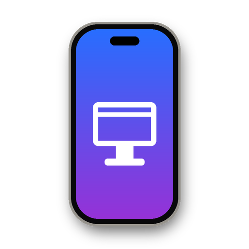

<p align="center">
  
</p>

<h1 align="center">iDesktop</h1>

<p align="center">
  <b>Your iPhone, floating on your Windows desktop.</b><br>
  Live HD mirror with touch, keyboard and sound, over USB or Wi-Fi. Free and open source.
</p>

<p align="center">
  <a href="https://github.com/realxhabib/iDesktop/actions/workflows/ci.yml"></a>
  <a href="LICENSE"></a>
  
</p>

<!-- Add a screenshot or GIF here, e.g. docs/screenshot.png -->

## What it does

- **HD mirror at up to 60 fps**: the iPhone's own screen stream, sharp text, low latency.
- **Floating phone**: no window frame, just the phone (titanium rim and working side buttons) on your desktop. Drag it anywhere; clicks around it go to your desktop.
- **Full control**:
  - Click and drag to tap and swipe; the mouse wheel scrolls.
  - Type on your PC keyboard. Alt works as ⌘ (Alt+Space opens Spotlight, Alt+C/V copies and pastes).
  - Buttons for Home, App Switcher, Control Center, Notifications, Spotlight, Siri and Back.
- **Sound**: the phone's audio plays on your PC, with an option to keep it quiet on the phone.
- **Clipboard sync** both ways, text and images.
- **Wireless**: after one wired start, it works over Wi-Fi with no cable and no admin rights.
- **Desktop Mode**: extra-small text for denser, iPad-like layouts. The classic window also has a Big Screen mode that fills your monitor.
- **Auto-rotate**, pinch zoom, screenshots at full resolution.

Everything runs locally. Nothing is sent anywhere but between your PC and your phone.

## Requirements

| | |
|---|---|
| PC | 64-bit Windows 10 (1809+) or Windows 11, with Microsoft Edge (preinstalled) |
| iPhone | **iOS 27 or newer** for the HD mirror. iOS 17-26 only gets Lite mode (needs the [extra](#optional-extra-webdriveragent)). |
| Apple driver | The [Apple Devices](https://apps.microsoft.com/detail/9NP83LWLPZ9K) app or iTunes from the Microsoft Store (the installer gets it for you) |
| Video | A GPU that decodes HEVC, plus Microsoft's [HEVC Video Extensions](https://apps.microsoft.com/detail/9NMZLZ57R3T7) on most PCs |
| Cable | A USB cable for the first start; after that, Wi-Fi works too |

Tested on an iPhone 16 Pro Max running iOS 27.0.1 and on Windows 11. Reports from other setups are very welcome; please [open an issue](../../issues).

## Install

Open **PowerShell** (Start menu, type *PowerShell*) and paste:

```powershell
irm https://raw.githubusercontent.com/realxhabib/iDesktop/main/install.ps1 | iex
```

It installs per user, with no admin needed:
- Python 3.13 (if you don't have 3.11-3.14)
- The Apple Devices app (if no Apple driver is present)
- iDesktop itself, in `%LOCALAPPDATA%\iDesktop`, with Start Menu and desktop shortcuts

Run the same command again to update.

## First start

1. Plug the iPhone in with a cable and unlock it.
2. Open **iDesktop**.
3. Follow the prompts. They appear only the first time:
   - **Trust This Computer?** Tap *Trust* on the iPhone and enter your passcode.
   - **Developer Mode** (the HD mirror needs it): on the iPhone, open Settings > Privacy & Security > Developer Mode and turn it on. The phone restarts. Then tap *Turn On* and click *Retry*.
   - iDesktop downloads Apple's developer disk image for your iOS version (about 20 MB).

The phone then appears on your desktop. From now on, opening iDesktop goes straight to it.

## Using it

| | |
|---|---|
| Tap / swipe | Click / drag on the screen |
| Scroll | Mouse wheel (Shift+wheel scrolls sideways) |
| Long press | Right-click (hold it as long as you like; right-drag to move icons) |
| Home | Middle-click the screen, or Ctrl+H |
| Move the phone | Drag its rim |
| Controls | The round **⋯** button next to the phone, Ctrl+M, or right-click the rim |
| Bigger / smaller | Ctrl+↑ / Ctrl+↓ |
| Side buttons | Click (or hold) the buttons on the rim: action, volume, power |
| Desktop Mode | Controls > Desktop Mode: extra-small, iPad-like text (click again to restore your text size) |
| Screenshot | Ctrl+P, saved to Downloads at full resolution |
| Keyboard | Just type. Alt = ⌘, Ctrl+L = lock, Ctrl+[ / ] = volume, Ctrl+S = Siri |
| On-screen keyboard | Ctrl+K or Controls > On-screen keyboard. iOS hides it while a hardware keyboard (iDesktop) is attached; this toggles it back |
| Classic window | Controls > Classic window (toolbar, accessibility and clipboard panels) |

### Floating controls

Click the round **⋯** button next to the phone (or press Ctrl+M) for these buttons. Hover over any of them in the app for a reminder.

| Button | What it does |
|---|---|
| **Home** | Goes to the home screen. Same as middle-clicking the screen, or Ctrl+H. |
| **App Switcher** | Shows your recent apps (swipe up and hold). |
| **Back** | Swipes in from the left edge, which is "back" in most apps. |
| **Control Center** | Swipes down from the top-right corner. |
| **Notifications** | Swipes down from the top-left corner. |
| **Spotlight** | Opens search on the home screen. |
| **Siri** | Holds the side button to start Siri (Ctrl+S). |
| **On-screen keyboard: on / off** | Shows or hides the iPhone's own keyboard in text fields (Ctrl+K); the button lights up while it's on. iOS hides it while your PC keyboard is connected, which iDesktop always is, so use this if you want it back. |
| **Zoom in / Zoom out** | A two-finger pinch at the centre of the screen. Ctrl + mouse wheel pinches where the mouse is. *Needs Automation.* |
| **Screenshot** | Saves the phone's screen to Downloads at full resolution (Ctrl+P). |
| **Desktop Mode** | Switches the phone to extra-small text, so apps fit more on screen, a bit like an iPad. Click again to restore your text size. |
| **PC sound: on / off** | Plays (or stops playing) the phone's sound through this PC. |
| **Sound on PC only** | Turns the phone's volume down to its lowest step, so the PC plays at full volume while the phone stays almost silent. *Needs Automation.* |
| **Dim phone** | Turns the phone's own screen down to minimum brightness. The mirror on your PC stays fully bright, so you can use the phone from the PC while it sits there almost dark. Click again (*Undim phone*) to bring it back. For near-black, also turn on Settings > Accessibility > Display & Text Size > *Reduce White Point*; you can put it on a triple-click with Accessibility Shortcut. |
| **Automation: on / off** | Turns the [WebDriverAgent](#optional-extra-webdriveragent) helper on or off (see below). |
| **Bigger / Smaller** | Resizes the phone (Ctrl+↑ / Ctrl+↓). |
| **Passcode keypad** | Types your passcode on the phone. iOS hides its own keypad from mirroring (lock screen, "Enable UI Automation"), so you'd see the prompt without its keys; this keypad (or your PC keyboard's number keys + Enter) types it anyway. Opens by itself when Automation is waiting for the passcode. |
| **Scroll speed** | How far one mouse-wheel notch scrolls: click to cycle Slowest, Slow, Normal, Fast, Fastest (remembered). |
| **Refresh** | Reloads the viewer and reconnects the picture, if it ever looks frozen while taps still work (same as F5). iDesktop also does this by itself after reconnecting. |
| **Classic window** | Switches to a normal window with a toolbar, accessibility settings, a clipboard panel and Big Screen. |
| **Disconnect** | Stops mirroring and releases the phone (its "Automation Running" notice goes away too), but keeps the floating phone on your desktop with a **Reconnect** button. |
| **Minimize / Quit** | Minimizes or closes iDesktop. |

### Automation

**Automation** is the WebDriverAgent helper running on your phone. It's Apple's UI-testing tool, installed as an [optional extra](#optional-extra-webdriveragent). In short:

| | Automation off (or not installed) | Automation on |
|---|---|---|
| HD mirror, touch, scrolling, keyboard, sound, clipboard | ✅ | ✅ |
| Dim phone, Desktop Mode, screenshots, wireless | ✅ | ✅ |
| Auto-rotate for landscape apps | – | ✅ |
| Pinch zoom (Zoom in/out, Ctrl + wheel) | – | ✅ |
| Sound on PC only | – | ✅ |
| Keep using the phone during calls ([Lite mode](#lite-mode)) | "Paused during your call" message | ✅ |
| "Automation Running" notice on the phone | none | shown |

The buttons that need it look dimmed in the controls while it's off. In detail, iDesktop uses it for:

- **Auto-rotate:** the mirror turns sideways when an app goes landscape.
- **Pinch zoom.**
- **Sound on PC only.**
- **[Lite mode](#lite-mode) during calls:** iOS stops sending the HD video while a call or the camera is active; iDesktop switches to Automation's own screen feed so you can keep using the phone until HD returns.

While Automation is on, iOS shows an **"Automation Running"** notice on the phone. Switch it off in the controls, or hold both volume buttons on the phone, and the notice goes away. Auto-rotate, pinch, *Sound on PC only* and the call backup pause until you switch it back on. Everything else keeps working: the HD mirror, touch, scrolling, keyboard and sound. iDesktop remembers your choice.

If you haven't installed the WebDriverAgent extra, the Automation button doesn't appear at all.

### Lite mode

During a phone or FaceTime call (or whenever an app is using the camera or microphone), iOS stops sending the HD video. With Automation on, iDesktop switches to **Lite mode** by itself: the phone stays live on your desktop and you keep controlling it as normal, at a lower frame rate and resolution. HD comes back automatically once the call ends. Without Automation you'll see a "paused during your call" message until then.

### Sound

Sound comes through the PC automatically, from any app except Apple Music, whose protected audio iOS won't share. The phone keeps playing too, because iOS has no "PC only" switch. **Controls > Sound on PC only** turns the phone's volume down to its lowest step, which keeps the PC copy at full volume. Volume 0 would mute both.

### Wireless

There's nothing extra to set up: start iDesktop once with the cable, and from then on it also starts with no cable. Keep the PC and iPhone on the same network (any Wi-Fi, or the PC on the iPhone's own Personal Hotspot); iDesktop finds the phone even if its address or the network changes. If the connection drops (Wi-Fi hiccup, phone restarted, cable pulled), the window stays open and the mirror reconnects by itself.

Video over Wi-Fi depends on your network; a cable gives the lowest latency.

### Optional extra: WebDriverAgent

These features need Appium's [WebDriverAgent](https://github.com/appium/WebDriverAgent) sideloaded onto the phone with your Apple ID:
- Pinch zoom
- Auto-rotate for landscape apps
- **[Lite mode](#lite-mode)**, which keeps working during phone and FaceTime calls (iOS pauses the HD mirror while the camera or microphone is in use)
- *Sound on PC only*

To set it up:

```powershell
powershell -ExecutionPolicy Bypass -File "$env:LOCALAPPDATA\iDesktop\app\extras\install-wda.ps1"
```

It builds `WebDriverAgent.ipa` and walks you through sideloading it with [Sideloadly](https://sideloadly.io). With a free Apple ID the app has to be re-sideloaded every 7 days; with a paid developer account, once a year.

## Troubleshooting

| Problem | Fix |
|---|---|
| "No iPhone found" | Use a data cable (not charge-only), unlock the phone, and make sure the Apple Devices app or iTunes is installed. |
| Trust prompt never appears / "Don't Trust" was tapped | Unplug. On the iPhone: Settings > General > Transfer or Reset iPhone > Reset > *Reset Location & Privacy*. Plug in again. |
| No Developer Mode setting on the iPhone | Start iDesktop once with the cable; that makes iOS show it. |
| Black screen, "cannot decode the HD video" | Install [HEVC Video Extensions](https://apps.microsoft.com/detail/9NMZLZ57R3T7) and reopen iDesktop. |
| HD stops during a call | iOS blocks screen streaming while the camera or mic is in use. HD comes back by itself after the call; with the WebDriverAgent extra you keep using the phone in [Lite mode](#lite-mode) meanwhile. |
| Won't start without the cable | Start it once with the cable (that sets up Wi-Fi pairing), keep both on the same network, and unlock the phone. Networks that isolate devices from each other (guest or hotel Wi-Fi) won't work. |
| A passcode prompt shows no number pad | iOS hides passcode keypads from mirroring. Use **Passcode keypad** in the controls (it opens by itself for "Enable UI Automation"), or type the digits on your PC keyboard and press Enter. |
| Picture frozen, but taps still work | Click **Refresh** in the controls (or press F5 in the iDesktop window). |
| Something else | Logs are in `%APPDATA%\iDesktop\logs`. Please attach `native.log` and `launcher.log` to an [issue](../../issues). |

## How it works

iOS 27 includes CoreDevice's *DisplayService*, the same screen stream Xcode's device mirror uses. iDesktop uses [pymobiledevice3](https://github.com/doronz88/pymobiledevice3) to open a no-admin, in-process tunnel to the phone, over USB or Wi-Fi (RemotePairing), and runs its `serve-web` viewer, which provides HEVC video over RTP, HID touch and keyboard, and AAC-ELD audio. iDesktop adds:

- **The viewer layer** (`idesktop/viewer_layer.py`):
  - The floating phone UI and controls.
  - In-order touch delivery, so drags stay drags.
  - Sharp drawing at window resolution, and a workaround for Edge's HEVC size bug.
  - Gestures, auto-rotate, Big Screen and Desktop Mode.
- **Windows audio** (`idesktop/native.py`): an FFmpeg AAC-ELD decoder (upstream only supports macOS), a stall watchdog that survives calls, a Wi-Fi fallback straight to the phone's IP (no Bonjour needed), and a WebDriverAgent relay through the same tunnel.
- **The floating window** (`idesktop/winshape.py`): Edge runs maximized and is clipped to the phone's shape with a window region. Maximized windows get no shadow or border, and the region makes everything outside the phone click-through.
- **The launcher** (`idesktop/app.py`): first-run setup, picking USB or Wi-Fi, and falling back to the Lite-mode WebDriverAgent viewer (`idesktop/controller.py`).

## Development

```powershell
git clone https://github.com/realxhabib/iDesktop.git
cd iDesktop
py -3.13 -m venv .venv
.venv\Scripts\pip install -r requirements.txt -r requirements-dev.txt
.venv\Scripts\python -m idesktop
```

- `python tools/e2e_test.py` tests the classic viewer against a mock WebDriverAgent; no phone needed.
- `python tools/check_viewer_js.py` syntax-checks the injected JavaScript (needs Node.js).
- `viewer_layer.py` is hot-reloaded: save it and the open viewer reloads itself without dropping the stream.
- Set `IDESKTOP_DEVTOOLS=9333` before starting to enable Edge DevTools for `tools/cdp.py`.

See [CONTRIBUTING.md](CONTRIBUTING.md).

## Credits

- [pymobiledevice3](https://github.com/doronz88/pymobiledevice3) by doronz88 and contributors (GPL-3.0) does all the talking to the phone; iDesktop wouldn't exist without it.
- [Appium WebDriverAgent](https://github.com/appium/WebDriverAgent) (BSD-3-Clause) for the optional extra.
- [PyAV](https://github.com/PyAV-Org/PyAV) / FFmpeg for audio decoding.

## License

iDesktop is free software under the [GNU GPL v3.0 or later](LICENSE).

iDesktop is not affiliated with or endorsed by Apple Inc. iPhone, iOS and Xcode are trademarks of Apple Inc.
